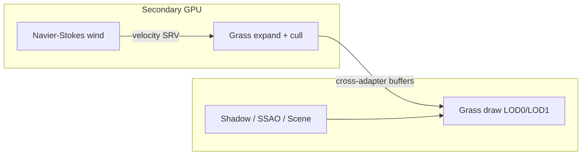

# MGPU Grass

**July 2026** · Author: [Matvei Matveev](https://github.com/averseble)

A DirectX 12 research harness for large-scale grass — hybrid single-GPU / multi-GPU paths, GPU wind, and automated performance sweeps.


[NOTICE.md](NOTICE.md) · [CONTRIBUTIONS.md](CONTRIBUTIONS.md) · [Architecture](docs/ARCHITECTURE.md)

---

## Introduction

MGPU Grass is a master's thesis project: a real-time grass field built to study how far a hybrid multi-adapter pipeline can push dense vegetation under measurable budgets.

It runs on top of [Mikhanil/Multi-GPU-Render-DX12](https://github.com/Mikhanil/Multi-GPU-Render-DX12) — a multi-GPU DX12 / PEPEngine sample framework (devices, queues, cross-adapter resources, shared-resource demos). This fork adds the grass system, wind simulation, research UI, and a CLI benchmark tool that turns “it feels faster” into CSV.

The demo project is **`MGPU-GrassSim`**. Upstream sample apps (e.g. `MGPU-Particles`) remain in the tree for reference.

---

## Features

- **Hybrid grass pipeline** — expand + frustum / distance LOD culling on a secondary GPU; draw on the primary via cross-adapter buffers
- **LOD model** — tessellated LOD0 blades + camera-facing LOD1 billboards, with separate density / scale controls
- **GPU wind** — Navier–Stokes stable-fluids field (inject → advect → divergence → pressure → project) plus multi-origin wind gradients
- **Research UI (ImGui)** — runtime toggles for single/multi-GPU, LOD, wind, obstacles, FPS limiter, adapter stats
- **Performance tooling** — `--perf-test` and `--perf-sweep` write reproducible CSV comparisons across load scenarios
- **Measured gains** — about **1.80×–2.48×** multi-GPU speedup across sweep scenarios (**~2.14×** mean)

---

## Pipeline overview

Each frame, grass goes through three stages:

1. **Wind** (secondary GPU, compute) — optional fluid / gradient field update  
2. **Expand + cull** (secondary GPU, compute) — instance expansion, frustum cull, LOD pick, wind response  
3. **Draw** (primary GPU, graphics) — LOD0 tessellation + LOD1 billboards in the main lighting path  



More detail: [docs/ARCHITECTURE.md](docs/ARCHITECTURE.md).

---

## Multi-GPU grass path

The core class is `Common/CrossAdapterGrassEmitter`. `EnableShared()` turns on the cross-adapter path; single-GPU mode keeps expand and draw on the same adapter so comparisons stay honest.

| Stage | File |
|-------|------|
| Expand / cull / wind sample | `MGPU-GrassSim/Shaders/ComputeGrass.hlsl` |
| LOD0 tessellation + LOD1 billboards | `MGPU-GrassSim/Shaders/GrassDraw.hlsl` |

---

## Performance sweep (the tools angle)

| Flag | Behavior |
|------|----------|
| *(none)* | Interactive demo + ImGui |
| `--perf-test` | One timed scenario → `grass-perf-results.csv` |
| `--perf-sweep` | Five load scenarios → `grass-perf-sweep-results.csv` |

### Sweep results

| Scenario | Single FPS | Multi FPS | Speedup |
|---|---:|---:|---:|
| baseline_mixed_lod | 49.27 | 88.82 | 1.80× |
| lod0_heavy | 44.67 | 92.75 | 2.08× |
| lod1_favoring | 43.92 | 81.08 | 1.85× |
| dense_mixed | 20.50 | 50.92 | 2.48× |
| ultra_dense_lod0_heavy | 13.25 | 32.69 | 2.47× |
| **Mean** | **34.32** | **69.25** | **2.14×** |

Numbers come from the automated sweep, not from hand-picked captures.

---

## Wind simulation

`WindFluidSimulator` is a classic GPU stable-fluids solver on a 2D grid (default 256×256):

| Pass | Shader |
|------|--------|
| Inject | `WindFluidInject.hlsl` |
| Advect | `WindFluidAdvect.hlsl` |
| Divergence | `WindFluidDivergence.hlsl` |
| Pressure | `WindFluidPressure.hlsl` |
| Project | `WindFluidProject.hlsl` |

LOD0 blades use a second-order response to the field; LOD1 uses a cheaper displacement. ImGui exposes origins, falloff, and a field preview so iteration does not require a rebuild.

---

## 1. How to run (execution environment)

**Environment:** Windows 10/11 (x64) · two GPUs recommended for multi-adapter · Visual Studio 2019/2022 (v142+) · Windows SDK 10.0.19041+ · NuGet · git submodules.

**Build from source**

1. `git clone --recurse-submodules https://github.com/averseble/Multi-GPU-Render-DX12-master.git`
2. Open `DX12.sln` → Restore NuGet packages
3. Build **MGPU-GrassSim** (`Release|x64` recommended)
4. Ensure `Data/` and `Shaders/` sit next to `MGPU-GrassSim.exe`

**Run**

```text
MGPU-GrassSim.exe              # interactive
MGPU-GrassSim.exe --perf-test  # one scenario → grass-perf-results.csv
MGPU-GrassSim.exe --perf-sweep # five scenarios → grass-perf-sweep-results.csv
```

ImGui (interactive): Single/Multi GPU, LOD, wind, adapter stats, FPS limiter.  
If the exe does not start in a reviewer environment, use the screen-capture video in the submission package.

---

## 2. Biggest challenge

Making the hybrid grass path correct under multi-adapter constraints: owning which GPU runs which stage, keeping world-space / LOD / wind data coherent across adapters, and turning that into a fair, reproducible measurement tool (fixed scenarios, warmup/sample windows, CSV) instead of visual impressions.

---

## 3. Please pay special attention to

Tools / work-efficiency side first:

**A) Automated performance sweep**

- `MGPU-GrassSim/Source.cpp` (`--perf-sweep` / `--perf-test`)
- `MGPU-GrassSim/HybridGrassSimApp.cpp` (`EnablePerformanceSweepMode`, CSV writers)
- Output: `grass-perf-sweep-results.csv` (mean ~2.14× — table above)

**B) Hybrid grass pipeline**

- `Common/CrossAdapterGrassEmitter.h` / `.cpp`
- `MGPU-GrassSim/Shaders/ComputeGrass.hlsl`
- `MGPU-GrassSim/Shaders/GrassDraw.hlsl`

**C) Research UI + wind**

- ImGui panels in `HybridGrassSimApp`
- `Common/WindFluidSimulator.h` / `.cpp`, `WindFluid*.hlsl`

Commit → feature map: [CONTRIBUTIONS.md](CONTRIBUTIONS.md).

---

## 4. Referenced / third-party source material

Full list: [NOTICE.md](NOTICE.md).

**Base framework (upstream)** — [Mikhanil/Multi-GPU-Render-DX12](https://github.com/Mikhanil/Multi-GPU-Render-DX12)

- `Graphics/*`, `Allocator/*`, most of `Common/*` app/scene/particle core
- Sample apps other than `MGPU-GrassSim` (e.g. `MGPU-Particles`, `MGPU-SFR`, …)
- `Utils/d3dx12.h` (Microsoft), `Utils/d3dUtil.*` (helpers; MiniEngine notes in file)

**Libraries** — Dear ImGui (`Submodule/imgui`); NuGet: assimp-v143, DirectXTK12, DirectXMesh, DirectXTex, WinPixEventRuntime

**Scene assets** — `MGPU-GrassSim/Data/Objects/*` (DoomSlayer, Nanosuit, P-Body, Atlas, dragons, StoneGolem, Temple, …)

Fork-specific files: section 3 and [CONTRIBUTIONS.md](CONTRIBUTIONS.md).

---

## Final Thoughts

This started as a graphics research problem and became more useful once measurement was part of the product: fixed scenarios, warmup windows, CSV output, ImGui knobs for fast iteration. Still a thesis codebase, not a shipping engine — but a concrete loop for tools-minded work: find friction, propose a split, instrument it, show the numbers.

https://github.com/averseble/Multi-GPU-Render-DX12-master

---

`DirectX12` `C++` `HLSL` `Multi-GPU` `Tools` `ImGui`
