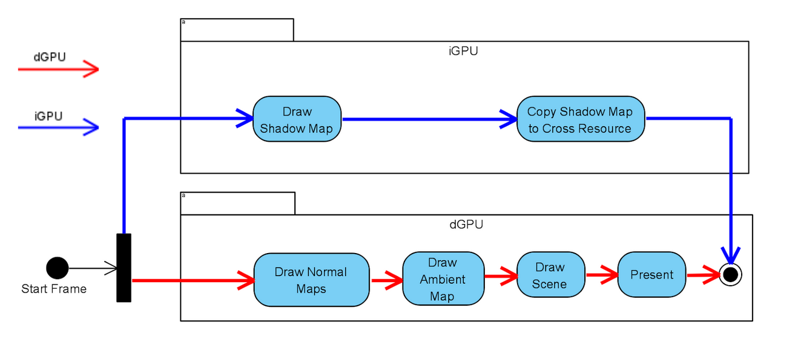
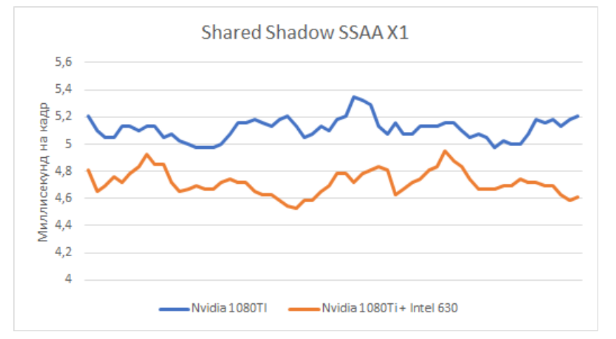
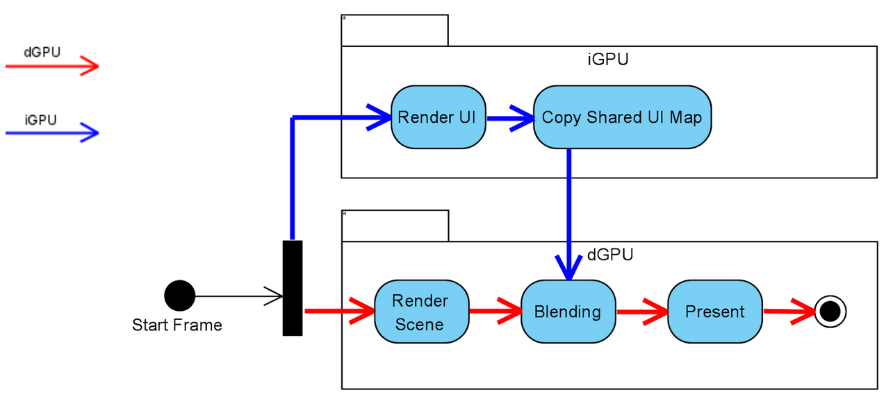
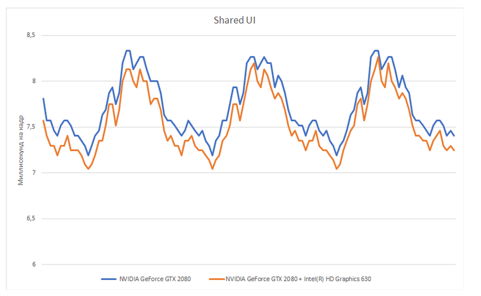
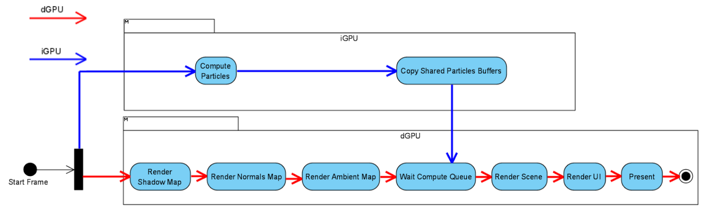
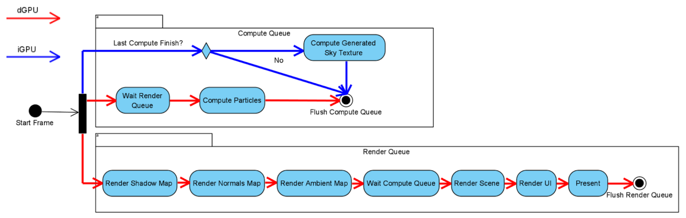
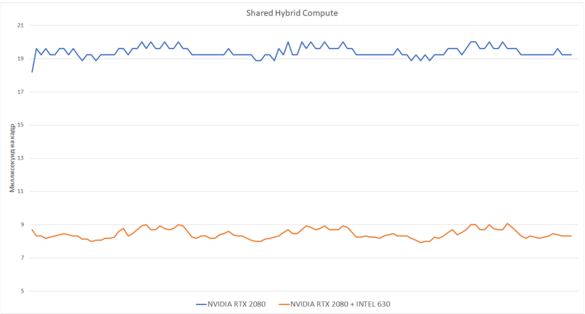
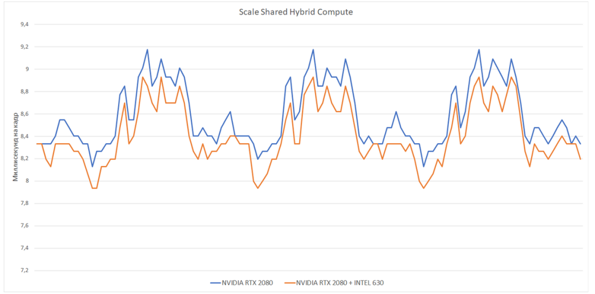

# DX12

This project is my master's thesis. Developed in collaboration with ITMO (https://itmo.ru/ru/) and Sperasoft (https://sperasoft.ru/) https://docs.google.com/presentation/d/16dh4ahcwjb1cMhcog0ikniztRQmwZcg1qDvM6XA27mo/edit#slide=id.p1

This project was taken as the basis for the graphics engine developed in the team. https://github.com/Pepengineers

Several interaction algorithms have been implemented:

## Shared Shadow Map

# Result

## Shared User Interface Blending

# Result

## Shared Particle System

## Shared Hybrid Compute

# Result with full shared

# Result with scaled resource

For the project you need:
 1. Windows SDK 19041 version
 2. Internet for restore Nuget packages
 3. More then one GPU (and/or iGPU/dGPU)
 
Steps for build:
  1. Restore Submodule
  2. Restore Nuget packages
  3. Build any Sample and Copy 'Data' and 'Shaders' folder to build directory

## Grass Performance Sweep (Single GPU vs Multi GPU)

The table below summarizes benchmark results collected with the automated sweep mode (`--perf-sweep`) for the grass simulation workload.

| Scenario | Single FPS | Multi FPS | FPS Gain | Gain % | Speedup |
|---|---:|---:|---:|---:|---:|
| baseline_mixed_lod | 49.27 | 88.82 | +39.55 | +80.27% | 1.80x |
| lod0_heavy | 44.67 | 92.75 | +48.08 | +107.63% | 2.08x |
| lod1_favoring | 43.92 | 81.08 | +37.16 | +84.61% | 1.85x |
| dense_mixed | 20.50 | 50.92 | +30.42 | +148.39% | 2.48x |
| ultra_dense_lod0_heavy | 13.25 | 32.69 | +19.44 | +146.72% | 2.47x |
| **Overall (arithmetic mean)** | **34.32** | **69.25** | **+34.93** | **+113.52%** | **2.14x** |

Across all tested scenarios, multi-GPU outperformed single-GPU, with speedups from **1.80x** to **2.48x**.
