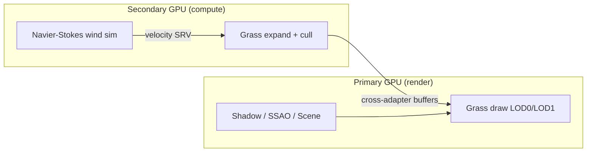

# Multi-GPU Grass Rendering — Master's Thesis (DirectX 12)


**Author:** [Matvey Matveev](https://github.com/averseble)  
**Type:** Master's thesis implementation — real-time grass field with hybrid single-GPU / multi-GPU pipeline  
**Stack:** C++17 · HLSL · DirectX 12 · ImGui

> **English summary below** — scroll to [English](#english)

---

## О проекте

Дипломная работа по real-time рендерингу больших травяных полей в DirectX 12 с распределением нагрузки между **дискретной GPU (dGPU)** и **интегрированной GPU (iGPU)** через cross-adapter ресурсы.

Демо собрано на базе multi-GPU фреймворка [Multi-GPU-Render-DX12](https://github.com/Mikhanil/Multi-GPU-Render-DX12) (Mikhanil). В оригинальном репозитории реализованы алгоритмы Shared Shadow Map, Shared UI Blending, Shared Particle System и Shared Hybrid Compute. **В этом форке — собственная исследовательская часть:** система травы, симуляция ветра и бенчмарк single-GPU vs multi-GPU.

### Что реализовано автором

| Компонент | Описание |
|-----------|----------|
| **CrossAdapterGrassEmitter** | Гибридный пайплайн: expand + frustum culling на второй GPU, отрисовка на primary |
| **LOD-система** | Billboard LOD1 / tessellated blades LOD0 с отдельными параметрами плотности и размера |
| **WindFluidSimulator** | GPU Navier–Stokes (stable fluids): inject → advect → divergence → pressure → project |
| **Wind gradient field** | Несколько источников ветра с falloff и превью поля в ImGui |
| **Second-order dynamics (LOD0)** | Физически мотивированный отклик травинок на ветер |
| **ImGui-панели** | Runtime-настройка LOD, ветра, препятствий, FPS limiter, статистика адаптеров |
| **Performance sweep** | Автоматический прогон 5 сценариев нагрузки, CSV-отчёт, сравнение режимов |

### Архитектура (multi-GPU)



Подробнее: [docs/ARCHITECTURE.md](docs/ARCHITECTURE.md)

---

## Требования

- Windows 10/11, **Visual Studio 2019+** (toolset v142+)
- **Windows SDK 10.0.19041** или новее
- **2 GPU** — dGPU + iGPU (или две дискретные; нужен cross-adapter)
- Интернет для NuGet restore
- Git с поддержкой submodules

---

## Сборка

```powershell
# 1. Клонировать с submodules
git clone --recurse-submodules https://github.com/averseble/Multi-GPU-Render-DX12-master.git
cd Multi-GPU-Render-DX12-master

# Если уже склонировано без submodules:
git submodule update --init --recursive

# 2. Открыть DX12.sln в Visual Studio
# 3. Restore NuGet packages (ПКМ по решению → Restore NuGet Packages)
# 4. Собрать проект **MGPU-GrassSim** (Debug|x64 или Release|x64)
# 5. Скопировать папки Data и Shaders в каталог с .exe (если post-build не сработал)
```

> Демо травы — проект **`MGPU-GrassSim`**. **`MGPU-Particles`** — отдельный сэмпл shared particle system из базового репозитория.

---

## Запуск

| Режим | Команда |
|-------|---------|
| Интерактивное демо | `MGPU-GrassSim.exe` |
| Один прогон бенчмарка | `MGPU-GrassSim.exe --perf-test` |
| Полный sweep (5 сценариев) | `MGPU-GrassSim.exe --perf-sweep` |

Результаты sweep: `grass-perf-sweep-results.csv` в рабочей директории exe.

В ImGui можно переключать **Single GPU / Multi GPU**, менять плотность травы, параметры ветра и LOD.

---

## Результаты бенчмарка

Автоматический режим `--perf-sweep`, сравнение single-GPU vs multi-GPU:

| Scenario | Single FPS | Multi FPS | FPS Gain | Gain % | Speedup |
|---|---:|---:|---:|---:|---:|
| baseline_mixed_lod | 49.27 | 88.82 | +39.55 | +80.27% | 1.80x |
| lod0_heavy | 44.67 | 92.75 | +48.08 | +107.63% | 2.08x |
| lod1_favoring | 43.92 | 81.08 | +37.16 | +84.61% | 1.85x |
| dense_mixed | 20.50 | 50.92 | +30.42 | +148.39% | 2.48x |
| ultra_dense_lod0_heavy | 13.25 | 32.69 | +19.44 | +146.72% | 2.47x |
| **Overall (arithmetic mean)** | **34.32** | **69.25** | **+34.93** | **+113.52%** | **2.14x** |

Multi-GPU стабильно быстрее во всех сценариях: **1.80x–2.48x**, в среднем **~2.14x**.

---

## Ключевые файлы

```
Common/
  CrossAdapterGrassEmitter.{h,cpp}   # multi-GPU grass pipeline
  WindFluidSimulator.{h,cpp}         # GPU wind simulation
  GrassEmitter.{h,cpp}             # grass data & LOD
MGPU-GrassSim/
  HybridGrassSimApp.{h,cpp}          # demo app, ImGui, benchmarks
  Shaders/
    ComputeGrass.hlsl              # expand, cull, wind sampling
    GrassDraw.hlsl                 # LOD0 tessellation + LOD1 billboards
    WindFluid*.hlsl                # Navier-Stokes passes
Graphics/
  GCrossAdapterResource.*          # cross-adapter resource sharing (base)
```

---

## Благодарности и лицензия

- **Base framework:** [Mikhanil/Multi-GPU-Render-DX12](https://github.com/Mikhanil/Multi-GPU-Render-DX12) — multi-GPU DX12 engine samples (Shared Shadow Map, Shared UI, Shared Particles, Shared Hybrid Compute).
- **ImGui:** [ocornut/imgui](https://github.com/ocornut/imgui) (submodule).
- **Frank Luna / DX12 samples** — часть утилит и структуры проекта в базовом репозитории.

Grass simulation, wind fluid, LOD pipeline, benchmarks и документация в этом репозитории — **авторская часть дипломной работы**.

---

## English

**Multi-GPU Grass Rendering** — a master's thesis project: large-scale real-time grass with DirectX 12 cross-adapter workload split between discrete and integrated GPUs.

Built on top of [Multi-GPU-Render-DX12](https://github.com/Mikhanil/Multi-GPU-Render-DX12). Original repo provides the multi-GPU framework; **this fork adds** grass rendering, GPU Navier–Stokes wind, LOD system, ImGui tooling, and automated single vs multi-GPU benchmarks (~**2.14x** mean speedup).

**Build:** clone with submodules → open `DX12.sln` → build **`MGPU-GrassSim`** → run `MGPU-GrassSim.exe` or `--perf-sweep` for benchmarks.

**Contact:** [github.com/averseble](https://github.com/averseble)
